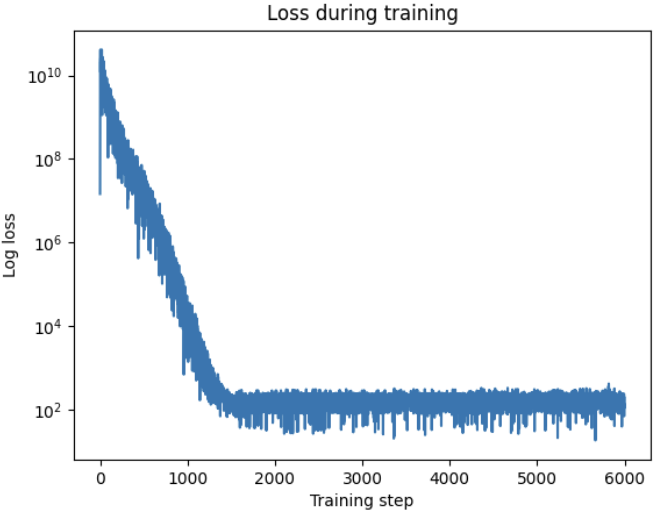
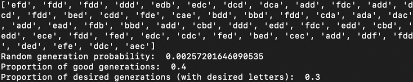
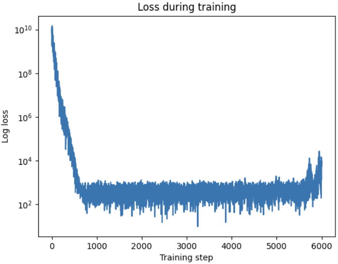
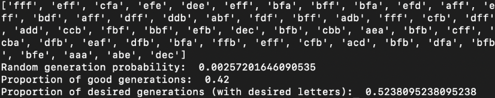

# GFlowNets -- Experiments with text generation using GFlowNets

This repo contains an exploratory project on the use of GFlowNets for text generation. In this simple case, GFlowNets are used to create strings _without any repeating letters_, and in some cases strings containing certain specific letters (with higher associated reward). To run the code, use `python train.py`.

## Preliminary Results - 3 letter words
These are the loss curves for running the training, with some example generations.

### Using no extra reward for including specific letters in the generations
This reward function gives the same reward for any valid generation (containing no repeating letters).

Desired letters are low in proportion within the generated valid strings (30% of valid generations).

### Using extra reward for including specific letters in the generations
This reward function gives additional reward for using specific letters in the generation ("a" in this example).

Desired letters are higher in proportion within the generated valid strings (52% of valid generations).
